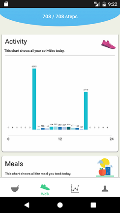
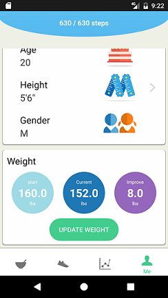

# Android application walking foodie
It is a android health app that allows people to manage their daily calorie input and output. For calorie input, people can enter their meals/snacks by typing or even by speaking. For calorie output, a step counting module is implemented to count the steps of the user and the calories burned can be calculated based on the steps and user's profile. The daily activity and history data is showed in well-designed charts.

## UI
The main page - showing the current steps the user made. The color of the circle has differnt meaning. When it turns red means the user should walk more.
Enter food page - user can enter by typing and speaking.
Daily activity panel - shows the calories input and output in user friendly charts.
User profile page.
User profile - weight gain and lose.

## Main work
I designed and implemented the database, daily activity panel,  profile panel and weight gain and lose.

